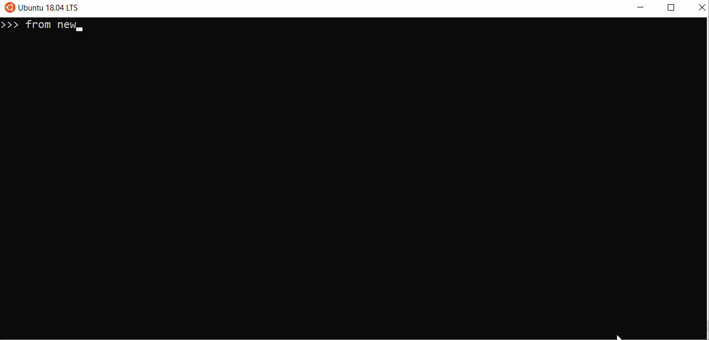
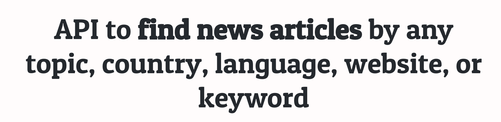

# Newscatcher
**Programmatically collect normalized news from (almost) any website.**

Filter by **topic**, **country**, or **language**.

By [newscatcherapi.com](https://www.newscatcherapi.com) (*this package is fully 
self-sufficient, you can just use it. No dependency on external services/API*)

## Demo


## Motivation
While working on [newscatcherapi](https://newscatcherapi.com/) - JSON API 
to query news articles,
I came up with an idea to make a simple Python package that would allow
to easily grab the live news data. 

When I used to be a junior data scientist working on my own side projects,
it was difficult for me to operate with external data sources. I knew Python
quite well, but in most cases it was not enough to build proper data pipelines
that required gathering data on my own. I hope that this package will help you 
with your next project. 

Even though I do not recommend to use this package for any production systems, 
I believe that it should be enough to test your assumptions and build some MVPs.

## Installation
`pip install newscatcher --upgrade` 


## Quick Start
```python
from newscatcher import Newscatcher
```

Get the latest news from [nytimes.com](https://www.nytimes.com/) 
(_we support thousands of news websites, try yourself!_) main news feed
```python
nc = Newscatcher(website = 'nytimes.com')
results = nc.get_news()

# results.keys()
# 'url', 'topic', 'language', 'country', 'articles'

# Get the articles
articles = results['articles']

first_article_summary = articles[0]['summary']
first_article_title = articles[0]['title']
```

Get the latest news from [nytimes.com](https://www.nytimes.com/) **politics** feed

```python
nc = Newscatcher(website = 'nytimes.com', topic = 'politics')

results = nc.get_news()
articles = results['articles']
```

There is a limited set of topic that you might find:

``` 'tech', 'news', 'business', 'science', 'finance', 'food', 'politics', 'economics', 'travel', 'entertainment', 'music', 'sport', 'world' ```

However, not all topics are supported by every newspaper.

How to check which topics are supported by which newspaper:
```python
from newscatcher import describe_url

describe = describe_url('nytimes.com')

print(describe['topics'])
```


### Get the list of all news feeds by topic/language/country
If you want to find the full list of supported news websites 
you can always do so using `urls()` function
```python
from newscatcher import urls

# URLs by TOPIC
politic_urls = urls(topic = 'politics')

# URLs by COUNTRY
american_urls = urls(country = 'US')

# URLs by LANGUAGE
english_urls = urls(language = 'en')

# Combine any from topic, country, language
american_english_politics_urls = urls(country = 'US', topic = 'politics', language = 'en') 

# note some websites do not explicitly declare their language 
# as a result they will be excluded from queries based on language
```


## Documentation

### `Newscatcher` Class
```python
from newscatcher import Newscatcher

Newscatcher(website, topic = None)
```
**Please take the base form url of a website** (without `www.`,neither `https://`, nor `/` at the end of url).

For example: “nytimes”.com, “news.ycombinator.com” or “theverge.com”.
___
`Newscatcher.get_news()` - Get the latest news from the website of interest.

Allowed topics:
`tech`, `news`, `business`, `science`, `finance`, `food`, 
`politics`, `economics`, `travel`, `entertainment`, 
`music`, `sport`, `world`

If no topic is provided, the main feed is returned.

Returns a dictionary of 5 elements:
1. `url` - URL of the website
2. `topic` - topic of the returned feed
3. `language` - language of returned feed
4. `country` - country of returned feed
5. `articles` - articles of the feed. [Feedparser object]((https://pythonhosted.org/feedparser/reference.html))

___

`Newscatcher.get_headlines()` - Returns only the headlines

___
`Newscatcher.print_headlines(n)` - Print top `n` headlines


<br> 
<br> 
<br> 

### `describe_url()` & `urls()`
Those functions exist to help you navigate through this package

___
```python
from newscatcher import describe_url
```

`describe_url(website)` - Get the main info on the website. 

Returns a dictionary of 5 elements:
1. `url` - URL of the website
2. `topics` - list of all supported topics
3. `language` - language of website
4. `country` - country of returned feed
5. `main_topic` - main topic of a website

___
```python
from newscatcher import urls
```

`urls(topic = None, language = None, country = None)` - Get a list of all supported 
news websites given any combination of `topic`, `language`, `country`

Returns a list of websites that match your combination of `topic`, `language`, `country`

Supported topics:
`tech`, `news`, `business`, `science`, `finance`, `food`, 
`politics`, `economics`, `travel`, `entertainment`, 
`music`, `sport`, `world`


Supported countries:
`US`, `GB`, `DE`, `FR`, `IN`, `RU`, `ES`, `BR`, `IT`, `CA`, `AU`, `NL`, `PL`, `NZ`, `PT`, `RO`, `UA`, `JP`, `AR`, `IR`, `IE`, `PH`, `IS`, `ZA`, `AT`, `CL`, `HR`, `BG`, `HU`, `KR`, `SZ`, `AE`, `EG`, `VE`, `CO`, `SE`, `CZ`, `ZH`, `MT`, `AZ`, `GR`, `BE`, `LU`, `IL`, `LT`, `NI`, `MY`, `TR`, `BM`, `NO`, `ME`, `SA`, `RS`, `BA`

Supported languages:
`EL`, `IT`, `ZH`, `EN`, `RU`, `CS`, `RO`, `FR`, `JA`, `DE`, `PT`, `ES`, `AR`, `HE`, `UK`, `PL`, `NL`, `TR`, `VI`, `KO`, `TH`, `ID`, `HR`, `DA`, `BG`, `NO`, `SK`, `FA`, `ET`, `SV`, `BN`, `GU`, `MK`, `PA`, `HU`, `SL`, `FI`, `LT`, `MR`, `HI`


## Tech/framework used
The package itself is nothing more than a SQLite database with 
RSS feed endpoints for each website and some basic wrapper of
[feedparser](https://pythonhosted.org/feedparser/index.html).


## About Us
We are Newscatcher API team. We are glad that you liked our package.

If you want to search for any news data, consider using [our API](https://newscatcherapi.com/)




[Artem Bugara]() - co-founder of Newscatcher, made v.0.1.0

[Maksym Sugonyaka](https://www.linkedin.com/mwlite/in/msugonyaka) - co-founder of Newscatcher, made v.0.1.0

[Becket Trotter](https://www.linkedin.com/in/beckettrotter/) - Python Developer, made v.0.2.0

## Licence
MIT
